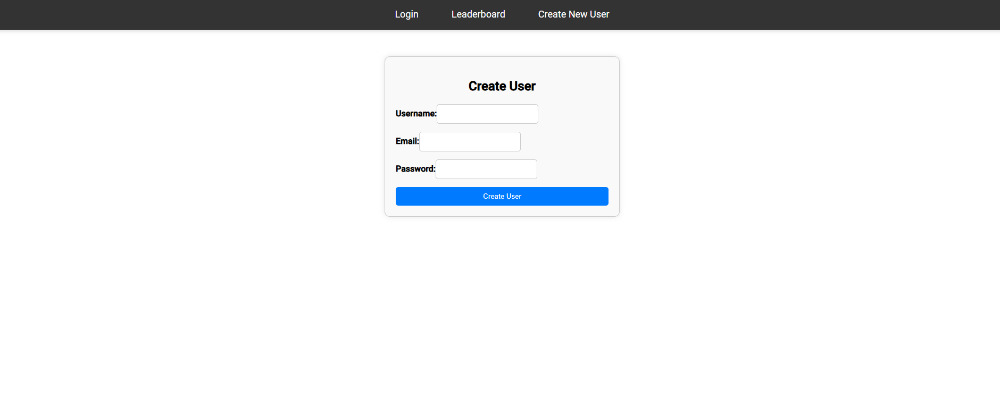
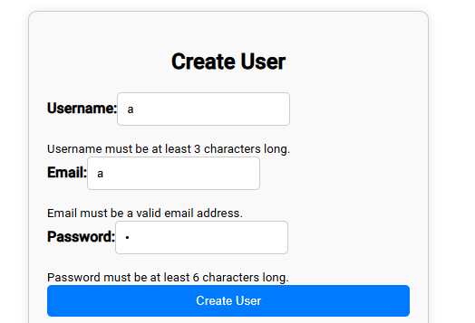
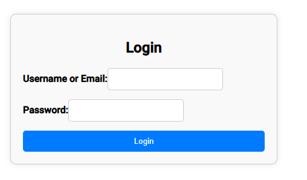
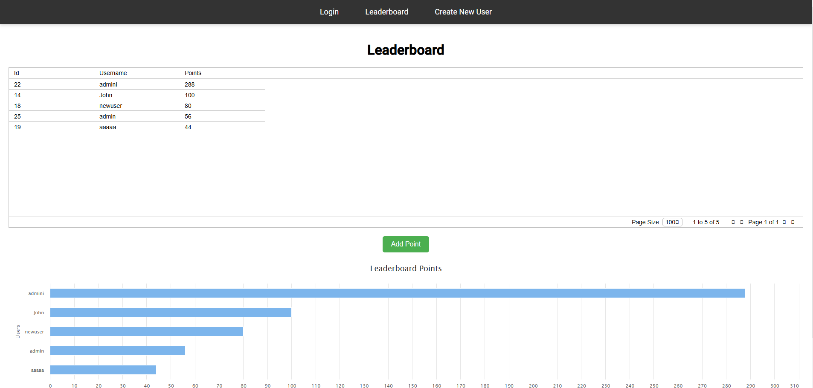
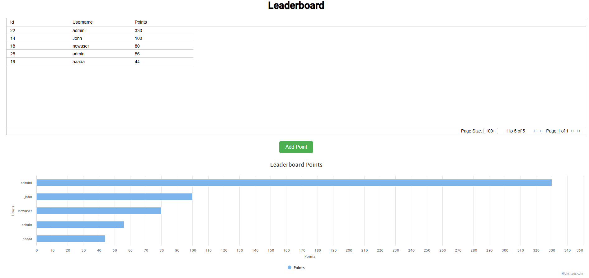
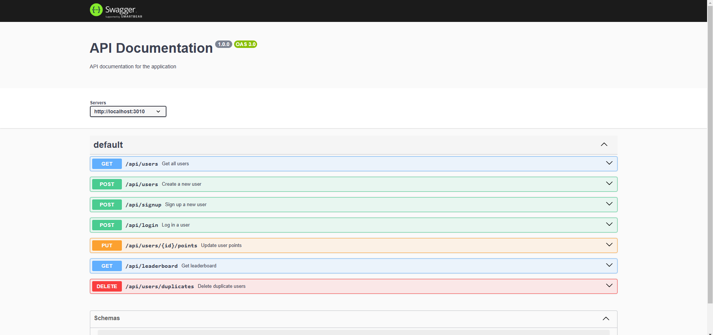

Clone the repository
git clone https://github.com/daragonfly/MON-PROJET
cd MON-PROJET

dependency :
npm install

Create file .env:

DB_HOST=localhost
DB_PORT=5432
DB_USER=arthur
DB_PASSWORD=arthur
DB_NAME=game

Configure in postgreSQL:

-- DROP DATABASE IF EXISTS game;
CREATE DATABASE game
    WITH
    OWNER = postgres
    ENCODING = 'UTF8'
    LC_COLLATE = 'French_France.1252'
    LC_CTYPE = 'French_France.1252'
    LOCALE_PROVIDER = 'libc'
    TABLESPACE = pg_default
    CONNECTION LIMIT = -1
    IS_TEMPLATE = False;

GRANT TEMPORARY, CONNECT ON DATABASE game TO PUBLIC;
GRANT ALL ON DATABASE game TO arthur;
GRANT ALL ON DATABASE game TO postgres;
Select * From users; //only when you launch the backend

To launch backend :

cd backend 
npx tsc 
npm start 
//at this point you just see 
test http://localhost:3010/api/users
or http://localhost:3010/api-docs/#/

And then do: 
cd..
cd frontend 
ng serve 
and you might go to http://localhost:4200/user-create
and you can test

So here is the html page of new-user: http://localhost:4200/user-create

So here is the html page of new-user: http://localhost:4200/login

and if the user put good identifier and password we are redirect to :
http://localhost:4200/leaderboard
with a token so we can improve the score of the user linked (here is ag-gird and highcharts):

and after multiple "add points":

and swagger page is this one :
http://localhost:3010/api-docs/
